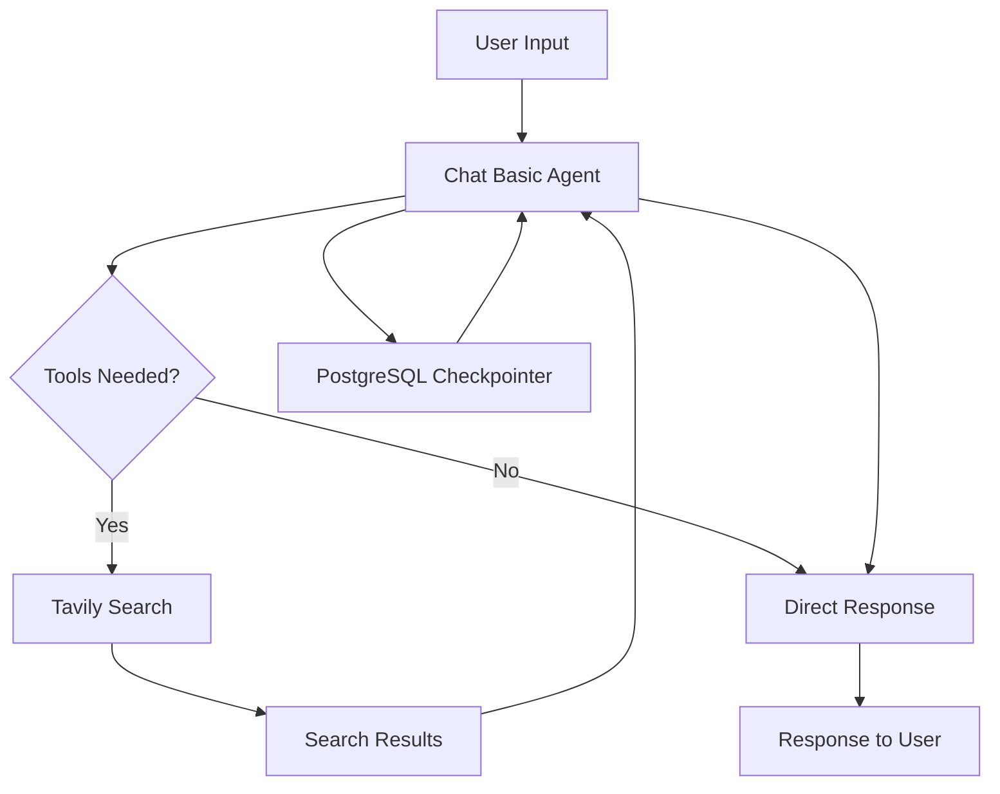

# LangGraph Chat Application

A simple but powerful conversational AI chat application built with LangGraph and enhanced with web search capabilities. This starter application demonstrates best practices for building chat agents with persistent conversation history, authentication, and tool integration.

## Project Overview

This application provides a single LangGraph workflow:

- **Chat Basic Graph**: A conversational AI agent with web search capabilities using Tavily Search, built with LangGraph's `create_react_agent` pattern and featuring PostgreSQL checkpointing for conversation persistence.

## Features

- 🤖 **Intelligent Chat Agent**: Powered by OpenAI models with customizable system prompts using ReAct pattern
- 🔍 **Web Search Integration**: Real-time web search using Tavily Search API with configurable depth and result limits
- 💾 **Conversation Persistence**: PostgreSQL-based checkpointing for maintaining chat history across sessions
- 🔐 **Authentication**: Bearer token authentication for secure API access with user management
- 🔧 **Configurable**: Environment-based configuration with runtime context support
- 📊 **Observability**: Optional LangSmith integration for monitoring and debugging
- 🎯 **Production Ready**: Built with LangGraph best practices and robust error handling
- 🛠️ **Extensible**: Easy tool integration with graceful fallbacks for missing API keys

## Getting Started

### Prerequisites

- Python 3.9 or higher
- PostgreSQL 14+ (for conversation persistence)
- OpenAI API key
- Tavily API key (for web search)
- LangSmith API key (optional, for observability)

### Installation

1. **Set up Python virtual environment**
   ```bash
   python -m venv venv
   source venv/bin/activate
   ```

3. **Install dependencies**
   ```bash
   pip install -e .
   ```

### Database Setup (Optional)

For conversation persistence, set up PostgreSQL:

1. **Install PostgreSQL**
   
   **macOS (using Homebrew):**
   ```bash
   brew install postgresql@15
   ```

2. **Create database**
   ```bash
   # Start PostgreSQL service
   brew services start postgresql@15 
   
   # Create database
   createdb chat_basic
   ```

### Environment Configuration

1. **Copy environment template**
   ```bash
   cp .env.example .env
   ```

2. **Configure your `.env` file**
   
   Required variables:
   ```bash
   # OpenAI Configuration
   OPENAI_API_KEY=your_openai_api_key_here
   OPENAI_MODEL=gpt-4.1-mini
   CHAT_MODEL=gpt-4.1-mini
   
   # Tavily Search Configuration
   TAVILY_API_KEY=your_tavily_api_key_here
   
   # Database Configuration
   DATABASE_URL=postgresql://localhost:5432/chat_basic
   
   # LangSmith Configuration
   LANGSMITH_API_KEY=your_langsmith_api_key_here
   LANGSMITH_PROJECT=chat-basic
   
   # Application Configuration
   DEBUG=false
   LOG_LEVEL=INFO
   ```

### API Keys Setup

1. **OpenAI API Key**
   - Sign up at [OpenAI Platform](https://platform.openai.com/)
   - Create an API key in your dashboard
   - Add to `.env` file

2. **Tavily API Key**
   - Sign up at [Tavily](https://tavily.com/)
   - Get your API key for web search functionality
   - Add to `.env` file

3. **LangSmith API Key** (Optional)
   - Sign up at [LangSmith](https://smith.langchain.com/)
   - Create an API key for monitoring and debugging
   - Add to `.env` file

## Authentication

The application includes Bearer token authentication to secure access to all LangGraph endpoints. Authentication is configured based on the [LangGraph Authentication Tutorial](https://langchain-ai.github.io/langgraph/tutorials/auth/getting_started/#2-add-authentication).

### Authentication Configuration

The authentication system consists of:

- **Authentication Module** (`src/security/auth.py`): Contains valid tokens and user authentication logic
- **LangGraph Configuration** (`langgraph.json`): Configured with authentication path
- **Bearer Token Validation**: All requests require valid tokens in the `Authorization` header

### Development Tokens

⚠️ **WARNING**: These are hardcoded tokens for development only. Do NOT use in production!

- `user1-token` → Alice (user1)
- `user2-token` → Bob (user2)  
- `admin-token` → Admin (admin)

### Making Authenticated Requests

#### Using the LangGraph SDK

```python
from langgraph_sdk import get_client

# Create client with authentication
client = get_client(
    url="http://localhost:2024",
    headers={"Authorization": "Bearer user1-token"}
)

# Now you can use the client normally
thread = await client.threads.create()
```

#### Using HTTP directly

```bash
# Example with curl
curl -H "Authorization: Bearer user1-token" \
     -X POST http://localhost:2024/threads
```

### Studio Access

By default, LangGraph Studio can access the server even with authentication enabled for easier development. To disable studio access for production-like testing, add this to `langgraph.json`:

```json
{
  "auth": {
    "path": "src/security/auth.py:auth",
    "disable_studio_auth": "true"
  }
}
```

### Running the Application

#### Using LangGraph CLI

1. **Install LangGraph CLI**
   ```bash
   # Python >= 3.11 is required for LangGraph CLI
   pip install --upgrade "langgraph-cli[inmem]"
   ```

2. **Start the LangGraph development server**
   ```bash
   langgraph dev
   ```
   
   Sample output:
   ```
   >    Ready!
   >
   >    - API: http://localhost:2024/
   >
   >    - Docs: http://localhost:2024/docs
   >
   >    - LangGraph Studio Web UI: https://smith.langchain.com/studio/?baseUrl=http://127.0.0.1:2024
   ```

3. **Test with LangGraph Studio**
   
   LangGraph Studio provides a specialized UI to visualize, interact with, and debug your application. Visit the Studio Web UI link to:
   - Visualize your graph structure
   - Test conversations interactively
   - Debug agent behavior and tool calls
   - Monitor execution flow

## Architecture

### Chat Basic Graph

The Chat Basic Graph (`src/chat_basic/`) provides an intelligent conversational interface with web search capabilities. Built using LangGraph's prebuilt `create_react_agent`, it offers a simple but powerful chat experience with runtime configuration support.

#### Core Components

**Agent Creation** (`src/chat_basic/agent.py`):
- Uses LangGraph's `create_react_agent` for streamlined ReAct pattern implementation
- Supports dynamic system prompts via the `get_system_prompt` function
- Integrates PostgreSQL checkpointing for conversation persistence
- Built-in interruption support for human-in-the-loop workflows
- Runtime context schema integration for dynamic configuration

**Tools Integration** (`src/chat_basic/utils/tools.py`):
- **Tavily Search**: Real-time web search with configurable result limits and search depth
- Runtime context-aware configuration (max_search_results, search_depth)
- Graceful fallback to mock tools when API keys are not configured
- Support for both new `langchain_tavily` and legacy `langchain_community` packages

**Configuration Management**:
- **Agent Config** (`src/chat_basic/utils/agent_config.py`): Agent-specific settings with validation
- **Context Schema** (`src/chat_basic/utils/context_schema.py`): Runtime context for dynamic configuration
- **Prompts** (`src/chat_basic/utils/prompts.py`): Dynamic prompt generation with context interpolation

**System Prompt** (`src/chat_basic/utils/prompts/chat_basic_system_prompt.txt`):
- Template-based system prompt with variable interpolation
- Runtime configuration values (max_search_results, search_depth)
- Guidelines for web search usage and response formatting
- Comprehensive tool usage instructions

#### Architecture Flow



#### Key Features

- **ReAct Pattern**: Uses reasoning and acting cycles for intelligent tool usage
- **Conversation Memory**: PostgreSQL-based persistence maintains context across sessions
- **Dynamic Configuration**: System prompts and search parameters configurable at runtime
- **Error Handling**: Graceful degradation when external services are unavailable
- **Observability**: Optional LangSmith integration for monitoring and debugging

### Chat Capabilities

The chat agent excels at:

- **Real-time Information**: Web search for current events, news, and facts
- **Conversational AI**: Natural language understanding and generation
- **Context Awareness**: Maintains conversation history and context
- **Educational Support**: Explaining concepts and providing detailed information
- **Research Assistance**: Finding and synthesizing information from multiple sources

## Project Structure

```
langgraph-starter-app/
├── langgraph.json          # LangGraph configuration with authentication
├── pyproject.toml          # Python project configuration and dependencies
├── README.md               # Comprehensive project documentation
├── .env.example           # Environment variable template
├── tests/                  # Test files
├── venv/                   # Virtual environment
├── src/
│   ├── chat_basic/         # Chat basic graph implementation
│   │   ├── __init__.py     # Module exports (AgentState, create_chat_basic_graph)
│   │   ├── agent.py        # Main chat graph creation using create_react_agent
│   │   └── utils/
│   │       ├── __init__.py
│   │       ├── agent_config.py    # Agent-specific configuration with validation
│   │       ├── context_schema.py  # Runtime context schema
│   │       ├── prompts.py         # Dynamic prompt generation
│   │       ├── tools.py           # Tool implementations (Tavily Search)
│   │       └── prompts/
│   │           └── chat_basic_system_prompt.txt  # System prompt template
│   ├── shared/             # Shared utilities and configurations
│   │   ├── __init__.py     # Module exports
│   │   ├── checkpoint.py   # PostgreSQL checkpointing implementation
│   │   └── config.py       # Application configuration management
│   └── security/           # Authentication and security
│       ├── __init__.py
│       └── auth.py         # Bearer token authentication implementation
└── examples/               # Example usage and tutorials
```

## Development

### Adding New Tools

To add new tools to the chat agent:

1. **Create your tool** in `src/chat_basic/utils/tools.py`:
   ```python
   from langchain_core.tools import Tool
   
   def my_custom_tool(query: str) -> str:
       # Your tool implementation
       return result
   
   # Add to prepare_basic_tools function
   custom_tool = Tool(
       name="my_custom_tool",
       description="Description of what your tool does",
       func=my_custom_tool
   )
   ```

2. **Update the system prompt** in `src/chat_basic/utils/prompts/chat_basic_system_prompt.txt` to include guidance on when and how to use your new tool.

### Configuration

The application uses environment-based configuration with multiple configuration layers:

**Global Configuration** (`src/shared/config.py`):
- **Database**: `DATABASE_URL` for PostgreSQL checkpointing
- **APIs**: `OPENAI_API_KEY`, `TAVILY_API_KEY` for core functionality
- **Observability**: `LANGSMITH_API_KEY`, `LANGSMITH_PROJECT` for monitoring
- **Application**: `DEBUG`, `LOG_LEVEL` for development settings

**Agent-Specific Configuration** (`src/chat_basic/utils/agent_config.py`):
- **Models**: `OPENAI_MODEL`, `CHAT_MODEL` for model selection
- **Search Settings**: `MAX_SEARCH_RESULTS`, `SEARCH_DEPTH` for Tavily configuration
- **Runtime Context**: Support for dynamic configuration via `ChatBasicContextSchema`

**Authentication Configuration** (`src/security/auth.py`):
- **Development Tokens**: Hardcoded tokens for development testing
- **Bearer Token Validation**: Secure token-based authentication

### Authentication Testing

To verify authentication is working properly:

1. **Test without authentication** (should fail):
   ```bash
   curl -X POST http://localhost:2024/threads
   ```

2. **Test with valid token** (should succeed):
   ```bash
   curl -H "Authorization: Bearer user1-token" \
        -X POST http://localhost:2024/threads
   ```

3. **Test with invalid token** (should fail):
   ```bash
   curl -H "Authorization: Bearer invalid-token" \
        -X POST http://localhost:2024/threads
   ```
